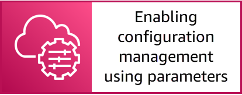

# Defining freeze periods and access controls


NOTE: You will incur charges as you go through either of these workshops, as they will exceed the [limits of AWS free tier](http://docs.aws.amazon.com/awsaccountbilling/latest/aboutv2/free-tier-limits.html).

## Table of Contents

- [Summary](#summary)
- [Instructions](#instructions)
    - [Create a Change Calendar](#create-a-change-calendar)
    - [Create a calendar event](#create-a-calendar-event)
    - [Create an Automation document](#create-an-automation-document)
    - [Run the custom Automation document](#run-the-automation-document)
- [Next Section](#next-section)

## Summary

Systems Manager Change Calendar lets you set up date and time ranges when actions you specify (for example, in Systems Manager Automation documents) may or may not be performed in your AWS account. In Change Calendar, these ranges are called events. When you create a Change Calendar entry, you are creating a Systems Manager document of the type ChangeCalendar. In Change Calendar, the document stores iCalendar 2.0 data in plaintext format. Events that you add to the Change Calendar entry become part of the document.

There are two types of Change Calendar entries:

* **DEFAULT_OPEN**: actions can run by default, but are blocked from running during associated events
* **DEFAULT_CLOSED**: actions do not run by default, but can run during events associated with the calendar entry

In this lab, you will:

1. Create an **Open by Default Calendar**.
1. Create an event on the calendar to block changes.
1. Create a custom Automation runbook that queries the calendar.
1. Run the Automation runbook to see the workflow being blocked by the calendar event.

## Instructions

### Create a Change Calendar

**To create the open by default calendar**

1. Open the AWS Systems Manager console at https://console.aws.amazon.com/systems-manager/.
1. In the navigation pane, choose [**Change Calendar**](https://console.aws.amazon.com/systems-manager/change-calendar/).
1. Choose **Create change calendar**.
1. For **Calendar name** enter: ```YOURNAME-cal-open```.

    -  For **Description**, optionally enter a description. In a real-world environment you would want to add additional meta data to help identify the calendar in complex environments.

1. For **Calendar type**, choose **Open by default**.
1. Choose **Create calendar**.

    

### Create a calendar event

**To create the closed event**

1. Select the calendar name to view the details of the calendar (or highlight the radio button and select **View details**).
1. On the **Events** tab, you will see the calendar view and the current month and day highlighted with a blue dot. Next, we will create an event to block changes.
1. Select **Create Event**.
1. On the **Create scheduled event** page, enter the following details:

    - For **Scheduled event name**, enter ```YOURNAME-nochanges```.
    - For **Description**, optionally enter a description for the test event.
    - For **Event start date**, set the start date as the current day and time as ```00:00:00```.
    - For **Event end date**, set the end date as tomorrow and the time as ```00:00:00```.
        - For example, if you are going through this workshop on Monday, May 3rd 2021:
            - Set the **Event start date** as ```05/03/2021 00:00:00```.
            - Set the **Event end date** as ```05/04/2021 00:00:00```.
        - **Important:** Ensure that the calendar time zone is set to your current time zone.
    - **Note:** You can also set reoccurrence which would be a powerful tool / use for regular events like application releases or change windows.

    

1. The event now shows up on your calendar in light blue on the day you specified.
1. Select the **Description** tab.
1. On the **Description** tab, you can expand the **Calendar use** section which shows you the code required to reference the calendar in a custom Automation runbook, from the AWS CLI command, and within a CloudWatch Events rule to check the calendar if the change is allowed or blocked.

    

You will now take this information and create a custom Automation document which queries the calendar state. Take note of the Change Calendar Amazon Resource Name (ARN) within the **Automation use** code and copy the ARN to your local notepad or keep this tab window open.

### Create an Automation document

**To create the custom Automation runbook**

1. Open the AWS Systems Manager console at https://console.aws.amazon.com/systems-manager/.
1. In the navigation pane, choose [**Documents**](https://console.aws.amazon.com/systems-manager/documents).
1. Choose **Create document** and then choose **Automation**.
1. For **Name**, enter a name for the custom Automation runbook, such as: ```yourname-stop-instances-check-calendar```.
1. Select the **Editor** tab.
1. Select **Edit** and select **OK** to make changes using the Document editor.
1. Replace the existing content with the below code. 

    - **Important:** On line 14, you must replace the ARN of the Change Calendar with the ARN of the calendar you created above.

    ```
    schemaVersion: "0.3"
    parameters:
      InstanceId:
        type: StringList
        description: "(Required) The instance to stop using AWS-StopEC2Instance"
    mainSteps:
    - name: checkChangeCalendarOpen
      action: aws:assertAwsResourceProperty # Asserts an event state for Change Calendar
      timeoutSeconds: 600
      inputs:
        Service: ssm
        Api: GetCalendarState
        CalendarNames:   ## List of calendars to check the status. 
        - arn:aws:ssm:us-east-1:123456789012:document/CustomerDemos
        PropertySelector: "$.State" # Returns OPEN / CLOSED as state
        DesiredValues:
        - OPEN   
      nextStep: stopInstances # if Change Calendar state is OPEN “stopInstances” step is executed, otherwise stop the workflow
    - name: stopInstances
      action: aws:executeAutomation # AWS-StopEC2Instance document is run for provided instances
      onFailure: Abort
      timeoutSeconds: 1800
      inputs:
        DocumentName: AWS-StopEC2Instance 
        RuntimeParameters:
          InstanceId: "{{ InstanceId }}"
    ```

1. Choose **Create automation**.

    
    
1. Once the document is created, select **View details** or select the **Owned by me** tab and open the custom Automation runbook.
1. Review the various tabs to understand the **Description**, **Content**, **Versions**, and **Details** of the runbook.

### Run the custom Automation document

**To run the Automation runbook**

1. Open the AWS Systems Manager console at https://console.aws.amazon.com/systems-manager/.
1. In the navigation pane, choose [**Automation**](https://console.aws.amazon.com/systems-manager/automation).
1. Choose **Execute automation**.
1. Select the **Owned by me** tab and select the radio button for the custom Automation runbook you created ```yourname-stop-instances-check-calendar```.
1. Choose **Next**.
1. On the **Execute automation document** page, perform the following steps:
    - For **InstanceId**, enter the EC2 instance ID of one of the instances you created in [Step 1: Enabling Inventory](/episode-01-step-01-enable-inventory.md).
    - Optionally expand the section **AWS CLI command and sharable execution link** to see a sharable execution link that pre-populates the parameters specified or to see a CLI command for Linux/Unix/OS X to run the specified runbook.
    - Select **Execute**.
    
    

The Automation runbook will evaluate the current status of the Change Calendar created earlier as the first step of the runbook. As the calendar is in a closed state, due to the event created previously, the first step ```checkChangeCalendarOpen``` will fail and the EC2 instance will not be stopped. If you run the Automation runbook tomorrow or at a different date/time where the calendar was in an ```OPEN``` state, then the EC2 instance would be stopped.


In a real-world environment, you can add override approval mechanisms to your Automation runbooks to allow for the specified approvers list to review if the Automation runbook should proceed even though the calendar is in a ```CLOSED``` state. This provides an easy and reliable way to fully automate the process of preventing undesired changes during critical time periods.

For further exploration using **Change Calendar** in **Systems Manager Automation** with override approval mechanisms, see the AWS blog post [Using AWS Systems Manager Change Calendar to prevent changes during critical events](https://aws.amazon.com/blogs/mt/using-aws-systems-manager-change-calendar-to-prevent-changes-during-critical-events/).

In episode 4 of this workshop, we will integrate Change Calendar with the **Change Manager** capability to ensure change requests only take place during the appropriate time periods.

## Next Section

Click the link below to go to the next section.

[](/episode-01-step-04-enable-state.md)