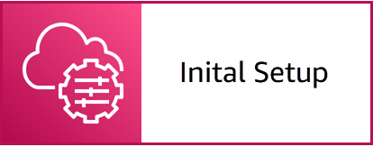

# Episode 3: Create Actionable Visibility for Enterprise Cloud Applications and Resources

NOTE: You will incur charges as you go through either of these workshops, as they will exceed the [limits of AWS free tier](http://docs.aws.amazon.com/awsaccountbilling/latest/aboutv2/free-tier-limits.html).

## Table of Contents

- [Summary](#summary)
- [Learning Objectives](#learning-objectives)
- [Gettting Started](#getting-started)

## Summary

The ability for the right people to see the right information, when they need it, and take appropirate actions is crucial to operations even with automation. In this episode, you will learn how to use AWS services and processes to enable visibility, in a context relevent to the individual, of applications and resources in cloud and hybrid cloud environments -- and take action.

In episode three, you will create an [Amazon CloudWatch alarm](https://docs.aws.amazon.com/AmazonCloudWatch/latest/monitoring/AlarmThatSendsEmail.html) to monitor the performance of an Amazon Elastic Cloud Compute (EC2) instance. You then use various capabilities of [AWS Systems Manager](https://aws.amazon.com/systems-manager/) to gain visibility into operational issues and resolve them, including:

- [Application Manager](https://docs.aws.amazon.com/systems-manager/latest/userguide/application-manager.html)
- [Explorer](https://docs.aws.amazon.com/systems-manager/latest/userguide/Explorer.html)
- [Fleet Manager](https://docs.aws.amazon.com/systems-manager/latest/userguide/fleet.html)
- [OpsCenter](https://docs.aws.amazon.com/systems-manager/latest/userguide/OpsCenter.html)
- [Quick Setup](https://docs.aws.amazon.com/systems-manager/latest/userguide/systems-manager-quick-setup.html)
- [Run Command](https://docs.aws.amazon.com/systems-manager/latest/userguide/execute-remote-commands.html)
- [Session Manager](https://docs.aws.amazon.com/systems-manager/latest/userguide/session-manager.html)

## Learning Objectives

- Learn how to use Explorer to aggregate data across multiple accounts and regions.
- Learn how to view and take action on operational data across your environment and in the context of an application.
- Learn how to remotely manage your server fleet using Fleet Manager.

## Getting Started

Click the link below to go to the next section and start setting the environment.

