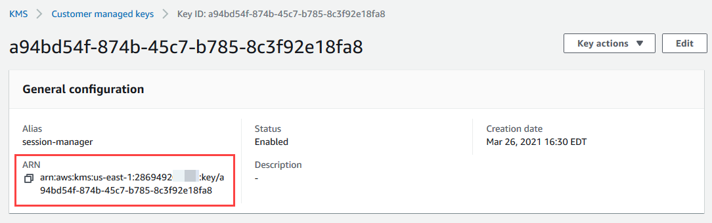
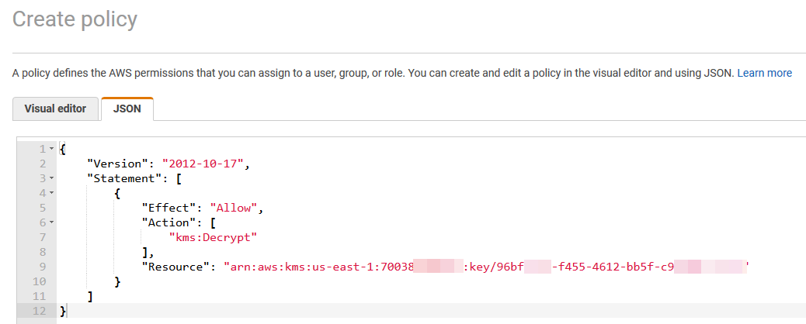
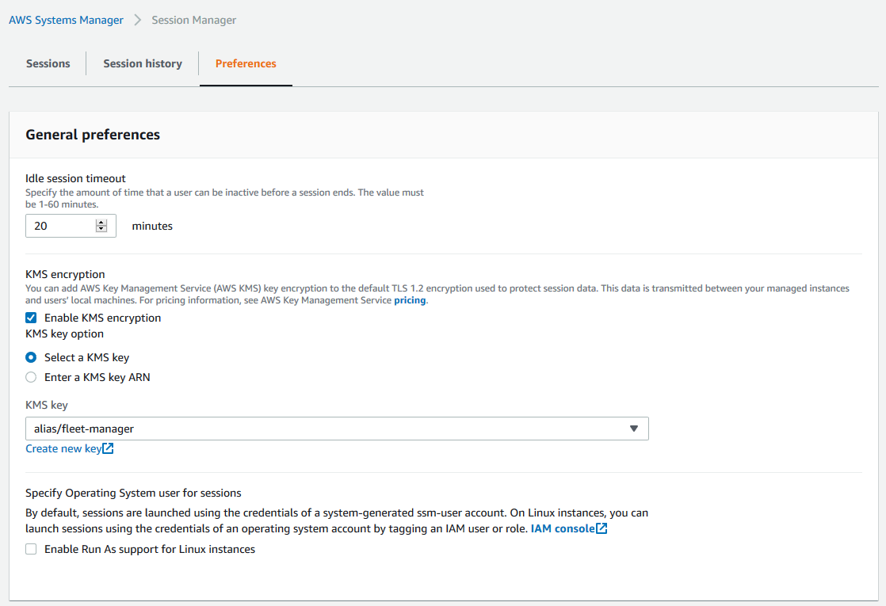
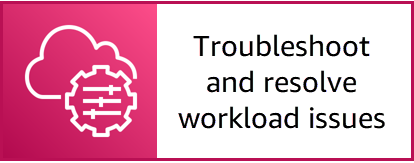

# Set up the workshop environment


NOTE: You will incur charges as you go through either of these workshops, as they will exceed the [limits of AWS free tier](http://docs.aws.amazon.com/awsaccountbilling/latest/aboutv2/free-tier-limits.html).

## Table of Contents

- [Summary](#summary)
- [Manual instructions](#manual-instructions)
    - [Create a test Windows EC2 instance](#create-a-test-windows-ec2-instance)
    - [Enable Quick Setup to create and attach the IAM role](#enable-quick-setup-to-create-and-attach-the-iam-role)
    - [Create the KMS key](#create-the-kms-key)
    - [Add KMS permissions to the IAM role](#add-kms-permissions-to-the-iam-role)
    - [Add KMS encryption to Session Manager preferences](#add-kms-encryption-to-session-manager-preferences)
    - [Confirm the EC2 instance is registered](#confirm-the-ec2-instance-is-registered)
- [CloudFormation instructions](#cloudformation-instructions)
    - [Create test resources using CloudFormation](#create-test-resources-using-cloudformation)
    - [(CloudFormation) Add KMS encryption to Session Manager preferences](#cloudformation-add-kms-encryption-to-session-manager-preferences)
- [Next Section](#next-section)

## Summary

In this section of the workshop you create an Amazon Elastic Compute Cloud (EC2) Windows instance with a PowerShell script that will stress test the CPU and consume CPU credits, if any are available. In the next section, you will create an Amazon CloudWatch alarm that monitors CPU usage. You can (1) manually launch an EC2 instance and configure AWS Systems Manager or (2) you create these resources using [AWS CloudFormation](https://aws.amazon.com/cloudformation/).

To create the test resources manually, skip to the section [Manual Instructions](#manual-instructions).

To create the resources using CloudFormation, skip to the section [CloudFormation instructions](#cloudformation-instructions).

## Manual Instructions

### Create a test Windows EC2 instance

1. Open the **Amazon Elastic Compute Cloud (EC2)** console at https://console.aws.amazon.com/ec2/v2/home.

    - **Important**: Ensure you are using the N. Virginia (us-east-1) region.

1. Choose **Launch Instance** and choose **Launch instance**.
1. In the list of Amazon Machine Images (AMI), choose **Select** for the **Microsoft Windows Server 2019 Base** AMI.
    - **Note**: You may need to scroll down.
    
    
    
1. Choose the instance type **t3.medium** and choose **Next: Configure Instance Details**.

    

1. On the **Step 3: Configure Instance Details** screen, perform the following steps:
    - Expand the **Advanced Details** section and copy/paste the following PowerShell commands in to the **User data**.
        - **Note**: The PowerShell commands below will download a test PowerShell script to stress test the CPU.

    ```
    <powershell>
    #
    #Download the script and save to the C: drive
    #
    Invoke-WebRequest `
        https://github.com/aws-samples/aws-cloud-and-hybrid-operations-workshop/blob/main/misc/loop-and-stress.ps1 `
        -OutFile c:\loop-and-stress.ps1

    #
    #Create Registry Entry needed by the stress script
    #
    New-Item -Path HKLM:\SOFTWARE -Name "benfelip"
    Set-ItemProperty -Path HKLM:\SOFTWARE\benfelip -Type DWORD -Name CrazyLogs -Value 1

    #Setup the trigger to run everytime it boots
    $trigger = New-JobTrigger -AtStartup -RandomDelay 00:00:30
    Register-ScheduledJob -Trigger $trigger -FilePath c:\loop-and-stress.ps1 -Name StressCPU

    </powershell>
    ```

    

1. Leave all the other the settings as default and choose **Next: Add Storage**.
1. For the **Step 4: Add Storage** page, leave the default settings and choose **Next: Add Tags**.
1. For the **Step 5: Add Tags** page, choose **click to add a Name tag**, enter ```TestWindowsInstance``` for the **Value**, choose **Next: Configure Security Group**.

    

1. For the **Step 6: Configure Security Group** page, choose **Create a new security group** and change the **Source** from **Custom** to **My IP**. Choose **Review and Launch**.

    

1. Choose **Launch**.
1. For **Select an existing key pair or create a new key pair**, choose **Proceed without a key pair** from the drop-down list, choose the check-box for **I acknowledge that I will not be able to connect to this instance unless I already know the password built into this AMI** and choose **Launch Instances**.
    - **Note**: In the next section you will use Session Manager to remotely connect to the EC2 instance which does not require a key pair.

### Enable Quick Setup to create and attach the IAM role

Use AWS Systems Manager Quick Setup to quickly configure frequently used AWS services and features with recommended best practices. You can use Quick Setup in an individual account or across multiple accounts and AWS Regions by integrating with AWS Organizations. Quick Setup simplifies setting up services, including AWS Systems Manager, by automating common or recommended tasks. These tasks include, for example, creating required AWS Identity and Access Management (IAM) instance profile roles and setting up operational best practices, such as periodic patch scans and inventory collection.

**To setup Quick Setup Host Management**

1. Open the **AWS Systems Manager** console at https://console.aws.amazon.com/systems-manager/.
1. In the navigation pane, choose [**Quick Setup**](https://console.aws.amazon.com/systems-manager/quick-setup).
1. Choose **Get started**.
1. Choose **Create**.
1. Choose **Host Management** and choose **Next**.

    - **Note**: If your AWS account is part of an AWS Organization and you are logged in to the root organization account, you also have an option to configure the Change Manager capability of Systems Manager.
    
1. On the **Customize Host Management configuration options**, ensure the defaults for **Systems Manager** are enabled:

    - Update Systems Manager (SSM) Agent every two weeks.
    - Collect inventory from your instances every 30 minutes.
    - Scan instances for missing patches daily.

1. In the **Targets** section, choose **Current Region** and choose **All instances**.
1. Choose **Create**.

    
    
    - Systems Manager Quick Setup will begin deploying a CloudFormation stack which creates the corresponding resources to enable Systems Manager best practices. After a few moments, the **Host Management** page should refresh and you can see the **Configuration deployment status**, **Configuration association status**, and **Configuration details** for the **Quick Setup** deployment.

    

1. Choose the radio button for the current account and Region and choose **View details**.    
1. On the **Association drilldown** page, you can review the **Association status**, **Instances per status**, **Schedule rate**, and **Last updated** timestamp for each association created by **Quick Setup**.


### Create the KMS key

In order to fully manage the instance with Fleet Manager, you need to configure a KMS Key and I assume you are following this in order.

1. Open the **AWS Key Management Service (KMS)** console at https://console.aws.amazon.com/kms/home.
1. In the navigation pane, choose **Customer managed keys**.
1. Choose **Create key**.
1. On the **Configure key** page, leave the default value of **Symmetric** for the **Key type** and choose **Next**.
1. On the **Add labels** page, for **Alias** enter ```fleet-manager```, and choose **Next**.
1. On the **Define key administrative permissions** page, select your IAM user or role you are currently logged in with, and choose **Next**.
1. On the **Define key usage permissions** page, select the EC2 IAM instance profile role **AmazonSSMRoleForInstancesQuickSetup**, and choose **Next**.
1. On the **Review** page, choose **Finish**.
1. Once the KMS key is created, note the **Amazon Resource Name (ARN)** of the KMS key and copy the value.

    

### Add KMS permissions to the IAM role

1. Open the **AWS Identity and Access Management (IAM)** console at https://console.aws.amazon.com/iam/home.
1. In the navigation pane, choose **Roles**.
1. Select the **AmazonSSMRoleForInstancesQuickSetup** role from the list to bring up the **Summary** page.
1. On the **Summary** page, choose **Add inline** policy.
1. On the **Create policy** page, choose the **JSON tab**.
1. Replace the default content with the following. 
    - **Important:** Replace **key-arn** with the ARN of the custom KMS key you created previously.

    ```
    {
        "Version": "2012-10-17",
        "Statement": [
            {
                "Effect": "Allow",
                "Action": [
                    "kms:Decrypt"
                ],
                "Resource": "key-arn"
            }
        ]
    }
    ```
    
    

1. Choose **Review policy**.
1. For **Name**, enter ```KMS_Permissions``` and choose **Create policy**.
    
### Add KMS encryption to Session Manager preferences

1. Open the **AWS Systems Manager** console at https://console.aws.amazon.com/systems-manager/home.
1. In the navigation pane, choose [**Session Manager**](https://console.aws.amazon.com/systems-manager/session-manager).
1. Choose **Configure Preferences**.
    - **Note**: If you have previously used Session Manager, choose the **Preferences** tab and choose **Edit**.
1. Choose **Enable KMS encryption**.
1. Choose **Select a KMS key** and choose the custom KMS key previously created from the drop-down list.

    

1. Choose **Save**.

### Confirm the EC2 instance is registered

1. Open System Manager console at https://console.aws.amazon.com/systems-manager/home.
1. In the navigation pane, choose [**Fleet Manager**](https://console.aws.amazon.com/systems-manager/managed-instances).
1. You should now see your test Windows EC2 instace in the managed instance list.
    - **Note**: If you do not see your test Windows EC2 instance, it may take a few minutes to check in. Periodically refresh this page to confirm.

    

You have now successfully created the test resources required for this workshop and can skip the **CloudFormation instructions** section. Proceed directly to the [**Next Section**](#next-section) to continue with the workshop.

## CloudFormation instructions

The [CloudFormation template](cfntemplates/ssm-workshop-resources-episode-03.yml) creates a test Windows EC2 instance and IAM instance profile role for System Manager.

### Create test resources using CloudFormation

**To save the CloudFormation template locally**
    
1. Open the CloudFormation template [ssm-workshop-resources-episode-03.yml](cfntemplates/ssm-workshop-resources-episode-03.yml).
1. Choose **Raw**.

    

1. Open Notepad and copy the entire text.
1. Save the file to your local machine as ```ssm-workshop-resources-episode-03.yml```.

The CloudFormation template will create the resources depicted in the diagram below.


**To create the workshop test resources**
    
1. Open the [AWS CloudFormation console](https://console.aws.amazon.com/cloudformation/home).
1. Choose **Create stack**.
1. For **Specify template**, choose **Upload a template file**, choose the file you saved locally ```ssm-workshop-resources-episode-03.yml```, and choose **Next**.

    

1. For **Stack name**, enter ```ssm-workshop-ep03```, and choose **Next**.
1. On the **Configure stack options** page, leave the defaults and choose **Next**.
1. On the **Review ssm-workshop-ep03** page, choose **I acknowledge that AWS CloudFormation might create IAM resources with custom names.**
1. Choose **Create stack**.

CloudFormation will begin provisioning the resources specified within the CloudFormation template and once complete, you will have one Windows EC2 instance to work with during this workshop. You can also use the refresh button to see the latest events related to the CloudFormation stack. Once the status of the CloudFormation stack changes to ```CREATE_COMPLETE```, you can proceed with the next steps. This process should complete within 5 minutes.

### (CloudFormation) Add KMS encryption to Session Manager preferences

1. Open the **AWS Systems Manager** console at https://console.aws.amazon.com/systems-manager/home.
1. In the navigation pane, choose [**Session Manager**](https://console.aws.amazon.com/systems-manager/session-manager).
1. Choose **Configure Preferences**.
    - **Note**: If you have previously used Session Manager, choose the **Preferences** tab and choose **Edit**.
1. Choose **Enable KMS encryption**.
1. Choose **Select a KMS key** and choose the custom KMS key created by the CloudFormation stack from the drop-down list (**alias/fleet-manager**).

    

1. Choose **Save**.

You have now completed the CloudFormation setup instructions for this workshop. You can now proceed to the [Next Section](#next-section).

## Next Section

**Congratulations** You ready to start configuring System Manager and troubleshoot this instance.

Click the link below to go to the next section.

[](/episode-03-step-02-troubleshoot.md)