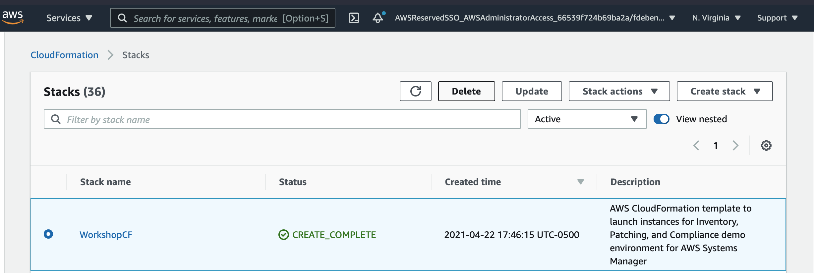
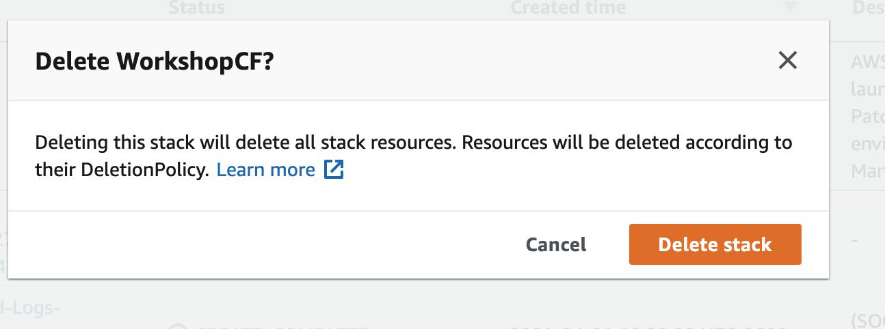
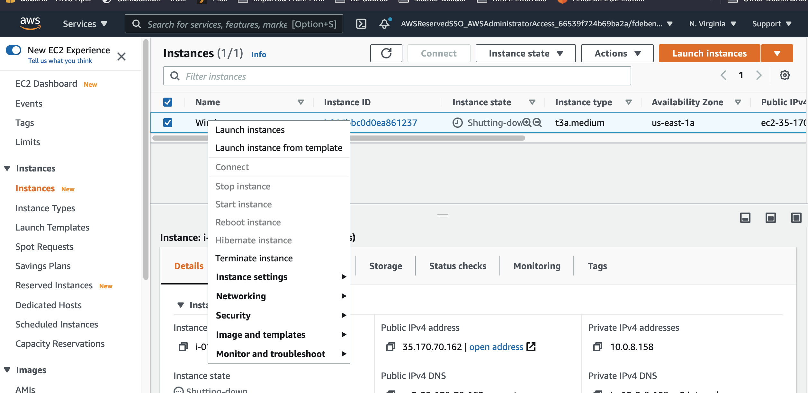

# Tear down workshop

**Congratulations!** You have completed the **Episode 3: Create Actionable Visibility for Enterprise Cloud Applications and Resources** workshop.

## Tear down instructions

**To delete the Quick Setup Host Management**

1. Open the AWS Systems Manager console at https://console.aws.amazon.com/systems-manager/.
1. In the navigation pane, choose [**Quick Setup**](https://console.aws.amazon.com/systems-manager/quick-setup).
1. Choose the **Host Management** configuration created previously, choose **Actions**, and choose **Delete Configuration**.

    1. Choose **Remove all OUs and Regions**.
    1. This process will take a few moments to complete, once complete proceed with the next step.

1. Choose **Actions** and choose **Delete configuration**.

    1. In the **Delete Configuration** window, type **delete**, and choose **Delete**

**To delete the CloudFormation stack**

1. Go to CloudFormation [console](https://console.aws.amazon.com/cloudformation/).

1. Select the stack you created during the setup and click **Delete**

1. Confirm deletion.

**To manually delete the Ec2 Instance**

1. Go to Ec2 [console](https://console.aws.amazon.com/ec2/).

1. Select the instance you created during the setup and right-click the instance and choose **Terminate instance**

## Next Section

Click the link below to go to the next episode, **Episode 4:  Automating Changes and Preventative Maintenance in an Enterprise / Cloud Environment**.

## Special Thanks

This workshop is inspired in part by the following AWS Management & Governance blog post: 
[Troubleshoot and resolve Windows workload issues using AWS Systems Manager Fleet Manager](https://aws.amazon.com/blogs/mt/troubleshoot-and-resolve-windows-workload-issues-using-aws-systems-manager-fleet-manager/)