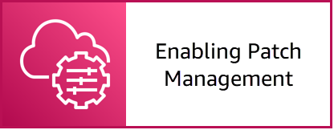

# Episode 4: Automating Changes and Preventative Maintenance in an Enterprise Cloud Environment

NOTE: You will incur charges as you go through either of these workshops, as they will exceed the [limits of AWS free tier](http://docs.aws.amazon.com/awsaccountbilling/latest/aboutv2/free-tier-limits.html).

## Table of Contents

- [Summary](#summary)
- [Learning Objectives](#learning-objectives)
- [Gettting Started](#getting-started)

## Summary

Balancing flexibility and time-to-market with control and stability to maximize availabiltiy, while reducing cumbersome processes, is critical to cloud operations. In this episode, you will learn how to use the services and processes to manage application and resource changes and patching across your cloud or hybrid cloud environment. 

## Learning Objectives

During this workshop episode, we will work towards the following learning objectives:

- Learn how to schedule and automate centralized patching operations across your AWS accounts and Regions and hybrid cloud environments.
- Learn how to manage change approvals, execution, and reporting.
- Learn how to report patching compliance status across your server fleet.

## Getting Started

Click the link below to go to the next section.

