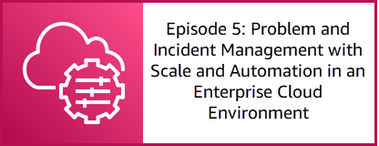

# Tear down workshop


To go back to the previous section, click here: [Enable Change Management](/episode-04-step-03-enable-change-management.md)

**Congratulations!** You have completed the **Episode 4: Proactive ops and automation / preventative maintenance** workshop.

## Tear down instructions

### Delete objects in the S3 buckets

<details>
<summary><b>To delete command logs stored by AWS Systems Manager</b></summary><p>

1. Open the Amazon S3 console at https://s3.console.aws.amazon.com/s3.
1. Choose the S3 bucket for command logs. The name will be similar to ```ssm-command-logs-us-east-1-123456789012```.
1. Choose **Empty**.

    1. On the **Empty bucket** page, type **permanently delete** to confirm deletion of the objects in the S3 bucket.
    1. Choose **Empty**.

</p></details>

<details>
<summary><b>To delete inventory data stored by AWS Systems Manager</b></summary><p>

1. Open the Amazon S3 console at https://s3.console.aws.amazon.com/s3.
1. Choose the S3 bucket for command logs. The name will be similar to ```ssm-resource-sync-us-east-1-123456789012```.
1. Choose **Empty**.

    1. On the **Empty bucket** page, type **permanently delete** to confirm deletion of the objects in the S3 bucket.
    1. Choose **Empty**.

</p></details>

### Delete the CloudFormation stack

<details>
<summary><b>To delete the CloudFormation stack</b></summary><p>

1. Open the AWS CloudFormation console at https://console.aws.amazon.com/cloudformation/home.
1. In the navigation pane, choose **Stacks**.
1. Choose the stack **ssm-workshop-ep04** and click **Delete**.
1. Choose **Delete stack**.

</p></details>

### Delete the SNS Topic

<details>
<summary><b>To delete the SNS topic</b></summary><p>

1. Open the Amazon SNS console at https://console.aws.amazon.com/sns/v3/home.
1. In the navigation pane, choose **Topics**.
1. Choose the SNS topic **ssm-workshop-sns** and choose **Delete**.
1. Enter ```delete me``` and choose **Delete**.

</p></details>

### Delete the IAM user

<details>
<summary><b>To delete the IAM user</b></summary><p>

1. Open the AWS IAM console at https://console.aws.amazon.com/iam/home.
1. In the navigation pane, choose **Users**.
1. Choose the user **approval-user**, choose **Delete user**, and choose **Yes, delete**.

</p></details>

### Delete the State Manager Association

<details>
<summary><b>To delete the State Manager associations</b></summary><p>

1. Open the Systems Manager console at https://console.aws.amazon.com/systems-manager/.
1. In the navigation pane, choose [**State Manager**](https://console.aws.amazon.com/systems-manager/state-manager).
1. Choose the radio button next to the association named **CloudWatchAgent-Install** and choose **Delete**.
1. In the **Delete association** window, choose **Delete**.

</p></details>


## Next Section

Click the link below to go to the next episode, **Episode 5: Problem and Incident Management with Scale and Automation in an Enterprise Cloud Environment**.

[](/episode-05-step-00-overview.md)