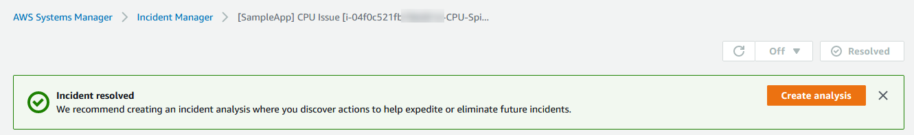
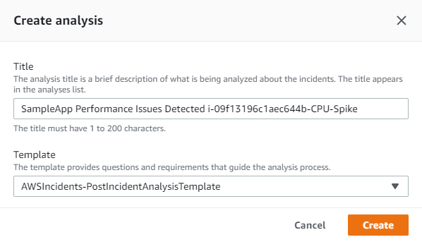
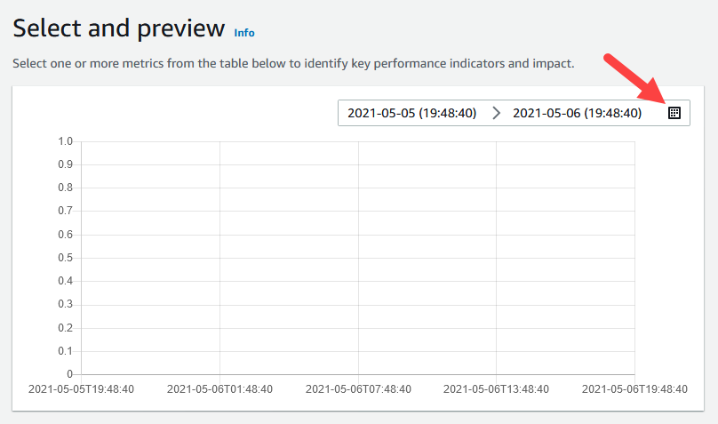
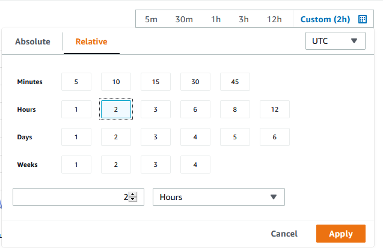
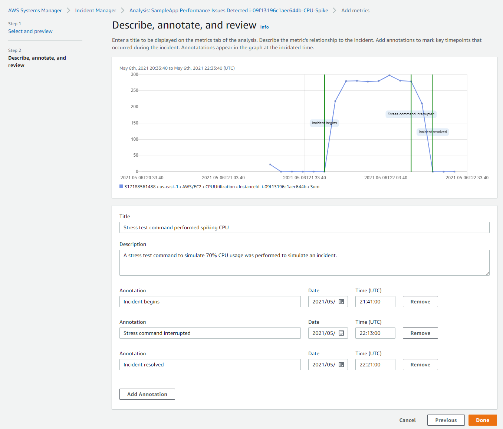
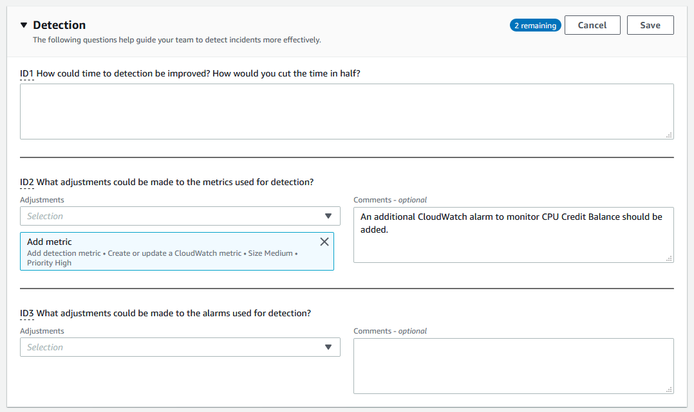
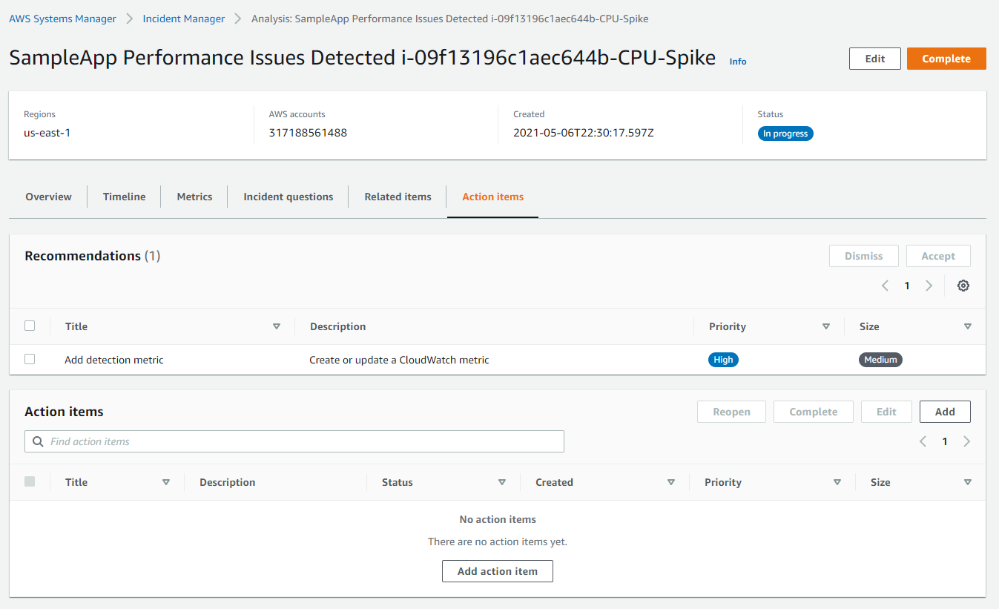
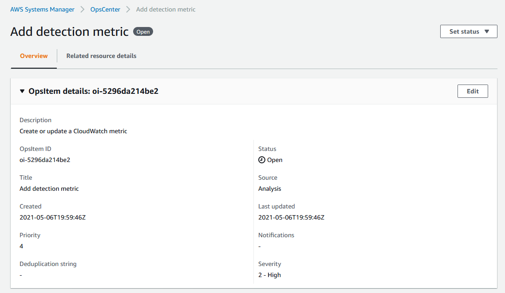

# Perform a post-incident analysis


NOTE: You will incur charges as you go through either of these workshops, as they will exceed the [limits of AWS free tier](http://docs.aws.amazon.com/awsaccountbilling/latest/aboutv2/free-tier-limits.html).

To go back to the previous section, click here: [Mitigate and respond to incidents](/episode-05-step-02-mitigate-respond.md).

## Table of Contents

- [Summary](#summary)
- [Instructions](#instructions)
    - [Create analysis for the incident](#create-analysis-for-the-incident)
    - [Add metrics](#add-metrics)
    - [Answer incident questions](#answer-incident-questions)
    - [Review related items](#review-related-items)
    - [Review action items](#review-action-items)
- [Next Section](#next-section)

## Summary

**Post-incident analysis** guides you through identifying improvements to your incident response, including time to detection and mitigation. An analysis can also help you understand the root cause of the incidents. Incident Manager creates recommended action items to improve your incident response. 

**Benefits of a post-incident analysis**

- Improve incident response
- Understand the root cause of the problem
- Address root causes with deliverable action items
- Analyze the impact of incidents
- Capture and share learnings within an organization

## Instructions

In this section you will perform a post-incident analysis.

### Create the analysis

1. Open the AWS Systems Manager console at https://console.aws.amazon.com/systems-manager/.
1. In the navigation pane, choose [**Incident Manager**](https://console.aws.amazon.com/systems-manager/incidents).
1. In the **Resolved incidents** section, choose the incident created during this workshop and choose **View details**.
1. Choose **Create analysis**.

    

1. In the **Create analysis** window, leave the default value for **Title**, choose **AWSIncidents-PostIncidentAnalysisTemplate**, and choose **Create**.

    

### Add metrics

1. Choose the **Metrics** tab and choose **Add metrics**.
1. First, modify the timeframe of the metric by choosing the edit button.

    

1. Choose the **Relative** tab, choose **2 hours**, choose **Apply**.

    

1. In the search bar, filter for ```Name: CPUUtiliziation```, choose the instance created by the CloudFormation stack, and choose **Next**.
1. On the **Describe, annotate, and review** page, enter a title and description for the event such as:

    - **Title**: ```Stress test command performed spiking CPU```.
    - **Description**: ```A stress test command to simulate 70% CPU usage was performed to simulate an incident.```
    
1. Choose **Add Annotation** to add an annotation to the metric graph. You can add annotations to identify key timepoints during the incident.
    
    - For **Annotation**, enter ```Incident begins``` and modify the time to match the beginning of the graph.
    - Choose **Add Annotation**.
    - For **Annotation**, enter ```Stress command interrupted``` and modify the time to match the peak of the graph.
    - Choose **Add Annotation**.
    - For **Annotation**, enter ```Incident resolved``` and modify the time to match the ending of the graph.
    
    

1. Choose **Done**.

### Answer incident questions

1. Choose the **Incident questions** tab to review the questions provided by the **AWSIncidents-PostIncidentAnalysisTemplate** analysis template.
1. Review each section briefly to see the list of pre-populated incident questions by the analysis template.
1. In the **Detection** section, choose **Edit**.
1. For the second question **ID2 What adjustments could be made to the metrics used for detection?**, choose **Add metric**, optionally enter a comment, and choose **Save**.

    
    
### Review related items

1. Choose the **Related items** tab to see resources related to the incident.
1. Optionally edit the existing CloudWatch alarm resource, or add/delete resources from this list.

### Review action items

1. Choose the **Action items** tab to see recommendations and action items.
    
    - :exclamation: **Important**: The **Recommendations** section will automatically be populated based on the answers you provided in the incident questions. You can choose to then **Accept** or **Dismiss** recommended items to add or remove them from the **Action items** list.
    
    

1. In the **Recommendations** section, select **Add detection metric** and choose **Accept**.

    - :information_source: Action items added will automatically have a corresponding [OpsCenter OpsItem](https://docs.aws.amazon.com/systems-manager/latest/userguide/OpsCenter.html) created so the appropriate individuals can track the status of action items by working on the corresponding [OpsItem](https://docs.aws.amazon.com/systems-manager/latest/userguide/OpsCenter-working-with-OpsItems.html).
    
    <details>
    <summary><b>:information_source: Example auto-generated OpsItem</b></summary><p>

    

    </p></details>

Once you have completed reviewing the various tabs of an analysis, choose **Complete**. In the resulting **Checklist** window, you can view answers provided, timeline events added, metrics added, and action items recommended. Choose **Complete** to complete the analysis process.

## Next Section

You have now completed the workshop **Episode 5: Problem and Incident Management with Scale and Automation in an Enterprise Cloud Environment**!

Click the link below to go to the next section to tear down the resources created during the workshop.

[](/episode-05-step-04-tear-down.md)