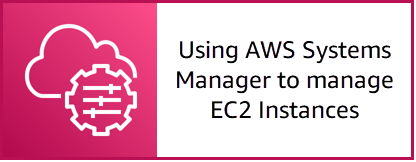

# Episode 01: Using Amazon Systems Manager as a Foundation for Operationally Excellent Workloads

NOTE: You will incur charges as you go through either of these workshops, as they will exceed the [limits of AWS free tier](http://docs.aws.amazon.com/awsaccountbilling/latest/aboutv2/free-tier-limits.html).

## Table of Contents

- [Summary](#summary)
- [Learning Objectives](#learning-objectives)
- [Gettting Started](#getting-started)

## Summary

AWS Systems Manager plays a key role in enabling operational excellence. AWS Systems Manager allows our customers to manage and enable the collection of operational telemetry from EC2 Instances, on-premise servers and virtual machines (VMs), and VMs in other cloud environments.

In this episode we will walk through setting up the Systems Manager (SSM) Agent on EC2, and using this to deploy and configure the CloudWatch Agent. Additionally, we will set up an Amazon CloudWatch alarm for performance metrics on the EC2 instance to create OpsItems in Systems Manager OpsCenter.

For more information about the various AWS Systems Manager capabilities see:

- [Automation](https://docs.aws.amazon.com/systems-manager/latest/userguide/systems-manager-automation.html)
- [Distributor](https://docs.aws.amazon.com/systems-manager/latest/userguide/distributor.html)
- [OpsCenter](https://docs.aws.amazon.com/systems-manager/latest/userguide/OpsCenter.html)
- [Run Command](https://docs.aws.amazon.com/systems-manager/latest/userguide/execute-remote-commands.html)
- [Session Manager](https://docs.aws.amazon.com/systems-manager/latest/userguide/session-manager.html)

## Learning Objectives

During this workshop episode, we will work towards the following learning objectives:

- Gain an understanding of how to use AWS Systems Manager to manage EC2 instances.
- Learn how to use the Systems Manager Agent to deploy and configure the CloudWatch agent.
- Learn how to use OpsItems to respond to changes in CloudWatch alarm state.

## Getting Started

Click the link below to go to the next section.

