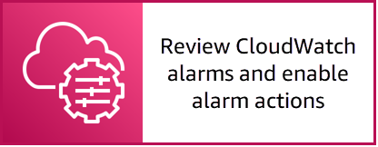

# Using AWS Systems Manager to manage EC2 instances


NOTE: You will incur charges as you go through either of these workshops, as they will exceed the [limits of AWS free tier](http://docs.aws.amazon.com/awsaccountbilling/latest/aboutv2/free-tier-limits.html).

## Table of Contents

- [Summary](#summary)
- [Instructions](#instructions)
    - [Create test EC2 instance](#create-test-ec2-instance)
    - [Create a State Manager Association to install CloudWatch agent](#create-a-state-manager-association-to-install-cloudwatch-agent)
    - [Create a State Manager Association to configure CloudWatch agent](#create-a-state-manager-association-to-configure-cloudwatch-agent)
    - [View metrics gathered by CloudWatch agent](#view-metrics-gathered-by-cloudwatch-agent)
- [Next Section](#next-section)

## Summary

The following section discusses three primary topics:

- [AWS Systems Manager State Manager](https://docs.aws.amazon.com/systems-manager/latest/userguide/systems-manager-state.html)
- [AWS Systems Manager Parameter Store](https://docs.aws.amazon.com/systems-manager/latest/userguide/systems-manager-parameter-store.html)
- [Amazon CloudWatch agent](https://docs.aws.amazon.com/AmazonCloudWatch/latest/monitoring/Install-CloudWatch-Agent.html)

[AWS Systems Manager State Manager](https://docs.aws.amazon.com/systems-manager/latest/userguide/systems-manager-state.html) is a secure and scalable configuration management service that automates the process of keeping your Amazon EC2 and hybrid infrastructure in a state that you define.

The following list describes the types of tasks you can perform with State Manager:

* Bootstrap instances with specific software at start-up.
* Download and update agents on a defined schedule, including SSM agent.
* Configure network settings.
* Join instances to a Windows domain (Windows Server instances only).
* Patch instances with software updates throughout their lifecycle.
* Run scripts on Linux and Windows managed instances throughout their lifecycle.

[AWS Systems Manager Parameter Store](https://docs.aws.amazon.com/systems-manager/latest/userguide/systems-manager-parameter-store.html) (Parameter Store) provides secure, hierarchical storage for configuration data management and secrets management. You can store data such as passwords, database strings, Amazon Machine Image (AMI) IDs, and license codes as parameter values. You can store values as plain text or encrypted data. You can reference Systems Manager parameters in your scripts, commands, SSM documents, and configuration and automation workflows by using the unique name that you specified when you created the parameter.

The unified [Amazon CloudWatch agent](https://docs.aws.amazon.com/AmazonCloudWatch/latest/monitoring/Install-CloudWatch-Agent.html) enables you to do the following:

- Collect internal system-level metrics from Amazon EC2 instances across operating systems. The metrics can include in-guest metrics, in addition to the metrics for EC2 instances. The additional metrics that can be collected are listed in [Metrics Collected by the CloudWatch agent](https://docs.aws.amazon.com/AmazonCloudWatch/latest/monitoring/metrics-collected-by-CloudWatch-agent.html).
- Collect system-level metrics from on-premises servers. These can include servers in a hybrid environment as well as servers not managed by AWS.
- Retrieve custom metrics from your applications or services using the StatsD and collectd protocols. StatsD is supported on both Linux servers and servers running Windows Server. collectd is supported only on Linux servers.
- Collect logs from Amazon EC2 instances and on-premises servers, running either Linux or Windows Server. 

## Instructions

In this section you will (1) create test Amazon Linux 2 Elastic Cloud Compute (EC2) instances, (2) install the Amazon CloudWatch agent, (3) connect to the managed instance using Session Manager, (4) use the CloudWatch agent configuration wizard, (5) store the configuration in Systems Manager Parameter Store, and (6) create a State Manager association to configure the CloudWatch agent.

To create the test Amazon Linux 2 EC2 instance, you will use [AWS CloudFormation](https://aws.amazon.com/cloudformation/). AWS CloudFormation gives you an easy way to model a collection of related AWS and third-party resources, provision them quickly and consistently, and manage them throughout their lifecycles, by treating infrastructure as code.

### Create test EC2 instance

**To save the CloudFormation template locally**
    
1. Open the CloudFormation template [oe-workshop-episode-01.yml](cfntemplates/oe-workshop-episode-01.yml).
1. Choose **Raw**.

    

1. Open Notepad and copy the entire text.
1. Save the file to your local machine as ```oe-workshop-episode-01.yml```.

The CloudFormation template will create the resources depicted in the diagram below.


**To create the test EC2 instance**
    
1. Open the [AWS CloudFormation console](https://console.aws.amazon.com/cloudformation/home).
1. Choose **Create stack**.
1. For **Specify template**, choose **Upload a template file**, choose the file you saved locally ```oe-workshop-episode-01.yml```, and choose **Next**.

    

1. For **Stack name**, enter ```oe-workshop```, and choose **Next**.
1. On the **Configure stack options** page, leave the defaults and choose **Next**.
1. On the **Review** page, choose **I acknowledge that AWS CloudFormation might create IAM resources with custom names.**, and choose **Create stack**.

CloudFormation will begin provisioning the resources specified within the CloudFormation template and once complete, you will have one Amazon Linux 2 EC2 instance to test and configure using Systems Manager. You can also use the refresh button to see the latest events related to the CloudFormation stack. Once the status of the CloudFormation stack changes to ```CREATE_COMPLETE```, you can proceed with the next steps. This process should complete within 5 minutes.

### Create a State Manager Association to install CloudWatch agent

**To create a State Manager association to install the CloudWatch agent**

1. Open the Systems Manager console at https://console.aws.amazon.com/systems-manager/.
1. In the navigation pane, choose [**State Manager**](https://console.aws.amazon.com/systems-manager/state-manager).
1. Choose **Create association** and perform the following steps:

    - For **Name**, enter ```CloudWatchAgent-Install```.
    - For **Document**, search for the document and select the radio button for the document **AWS-ConfigureAWSPackage**.
    - In the **Parameters** section, perform the following steps:
        - Leave the default values for **Action** and **Installation Type**.
        - For **Name**, enter ```AmazonCloudWatchAgent```.
    - For **Targets**, choose **Choose instances manually**.
        - Choose the instance created above.
    - In the **Specify schedule** section, perform the following steps:
        - For **Specify with**, select **CRON/Rate expression**.
        - For **CRON/Rate expression**, enter ```rate(1 day)```.
    - Choose **Create Association**.
    
1. Once the create association request completes, choose the association name to view details about the association. After the status of the association changes to **Success**, continue with the next steps.

    
    
### Connect to the instance using Session Manager

1. Open the Systems Manager console at https://console.aws.amazon.com/systems-manager/.
1. In the navigation pane, choose [**Session Manager**](https://console.aws.amazon.com/systems-manager/session-manager/sessions).
1. Choose **Start session**.
1. On the **Start a session** page, choose the **TestAmazonLinuxInstance** and choose **Start session**.
    - You will then have an interactive session established with the EC2 instance.
    
    

#### Configure the CloudWatch Agent

1. Start the CloudWatch agent configuration wizard by entering the following command:

    ```
    sudo /opt/aws/amazon-cloudwatch-agent/bin/amazon-cloudwatch-agent-config-wizard
    ```
    
    
    
1. Navigate through the CloudWatch agent configuration wizard by entering the following choices:

Question | Choice
------------- | -------------
**On which OS are you planning to use the agent?**  | ```1```
**Are you using EC2 or On-Premises hosts?**  | ```1```
**Which user are you planning to run the agent?** | ```1```
**Do you want to turn on StatsD daemon?** | ```2```
**Do you want to monitor metrics from CollectD??** | ```2```
**Do you want to monitor any host metrics? e.g. CPU, memory, etc.** | ```1```
**Do you want to monitor cpu metrics per core? Additional CloudWatch charges may apply.** | ```2```
**Do you want to add ec2 dimensions (ImageId, InstanceId, InstanceType, AutoScalingGroupName) into all of your metrics if the info is available?** | ```1```
**Would you like to collect your metrics at high resolution (sub-minute resolution)? This enables sub-minute resolution for all metrics, but you can customize forspecific metrics in the output json file.** | ```4```
**Which default metrics config do you want?** | ```1```
**Are you satisfied with the above config? Note: it can be manually customized after the wizard completes to add additional items.** | ```1```
**Do you have any existing CloudWatch Log Agent (http://docs.aws.amazon.com/AmazonCloudWatch/latest/logs/AgentReference.html) configuration file to import for migration?** | ```2```
**Do you want to monitor any log files?** | ```2```
**Do you want to store the config in the SSM parameter store?** | ```1```
**What parameter store name do you want to use to store your config? (Use 'AmazonCloudWatch-' prefix if you use our managed AWS policy)** | ```AmazonCloudWatch-linux```
**Which region do you want to store the config in the parameter store?** | ```us-east-1```
**Which AWS credential should be used to send json config to parameter store?** | ```1```

The CloudWatch agent configuration wizard should then successfully put the config to parameter store using the name **AmazonCloudWatch-linux** and the program will exit. You can now exit the Session Manager session by choosing **Terminate** and then on the **Terminate session** window choosing **Terminate**.

### View the configuration file in Parameter Store

1. Open the Systems Manager console at https://console.aws.amazon.com/systems-manager/.
1. In the navigation pane, choose [**Parameter Store**](https://console.aws.amazon.com/systems-manager/parameters).
1. Choose the parameter **AmazonCloudWatch-linux** and choose **View details**.

    

1. In the **Value** section, you can see the basic CloudWatch agent configuration created using the CloudWatch agent configuration wizard. You can then reference this Parameter Store parameter to configure the CloudWatch agent on other managed instances using the Systems Manager document ```AmazonCloudWatch-ManageAgent```.

    

### Create a State Manager Association to configure CloudWatch agent

**To create a State Manager association to configure the CloudWatch agent**

1. Open the Systems Manager console at https://console.aws.amazon.com/systems-manager/.
1. In the navigation pane, choose [**State Manager**](https://console.aws.amazon.com/systems-manager/state-manager).
1. Choose **Create association** and perform the following steps:

    - For **Name**, enter ```CloudWatchAgent-Configure```.
    - For **Document**, search for the document **AmazonCloudWatch-ManageAgent** and select the radio button for the document **AmazonCloudWatch-ManageAgent**.
    - In the **Parameters** section, perform the following steps:
        - Leave the default values for **Action**, **Mode**, and **Optional Configuration Source**.
        - For **Optional Configuration Location**, enter the name of the Parameter Store parameter: ```AmazonCloudWatch-linux```.
            - **Important:** The name of the parameter is case-sensitive.
        - Leave the default values for **Optional Open Telemetry Collector Configuration Source**, **Optional Open Telemetry Collector Configuration Location**, and **Optional Restart**.
        
    
        
    - For **Targets**, choose **Choose instances manually**.
        - Choose the instance created above.
    - In the **Specify schedule** section, perform the following steps:
        - For **Specify with**, select **CRON/Rate expression**.
        - For **CRON/Rate expression**, enter ```rate(1 day)```.
    - Choose **Create Association**.

    

1. Select radio button next to the **CloudWatchAgent-Configure** **Association ID** to review the **Association details**

    - Review the various tabs of the association to see different information about the association. After the status of the association changes to **Success**, continue with the next steps.

## Next Section

Click the link below to go to the next section.

[](/episode-01-step-02-enable-alarm-actions.md)